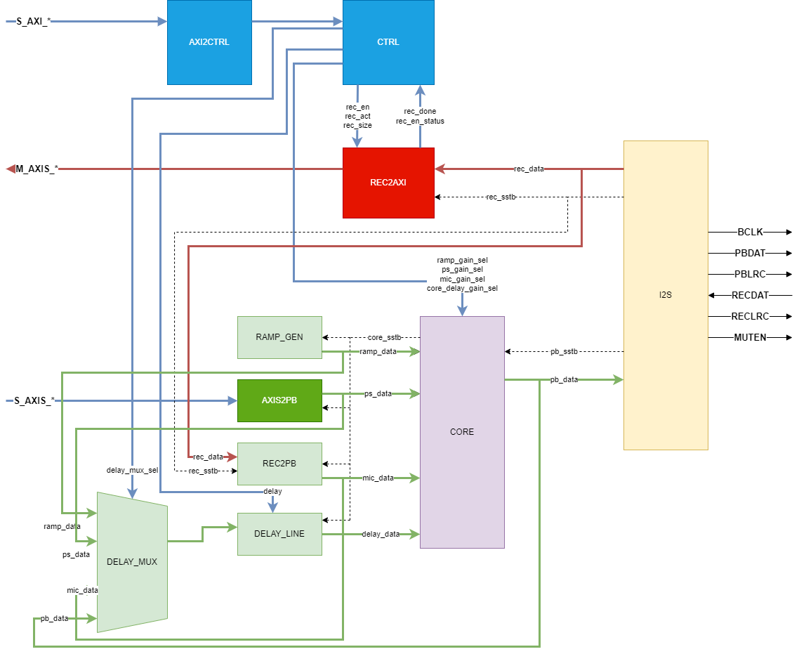
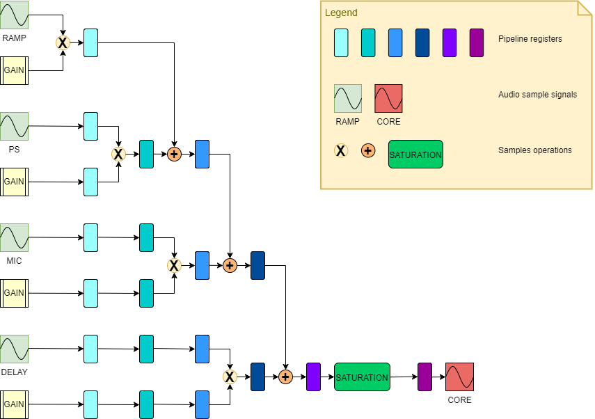

- [Introduction](#introduction)
- [Theory of operation](#theory-of-operation)
  - [Block diagram](#block-diagram)
    - [AXI2CTRL \& CTRL](#axi2ctrl--ctrl)
    - [CORE](#core)
    - [I2S](#i2s)
    - [REC2AXIS](#rec2axis)
    - [AXIS2PB](#axis2pb)
    - [DELAY\_LINE \& DELAY\_MUX](#delay_line--delay_mux)
    - [RAMP\_GEN](#ramp_gen)
    - [REC2PB](#rec2pb)
- [Performance](#performance)
- [FPGA resource utilization for __XC7010__ device](#fpga-resource-utilization-for-xc7010-device)
- [Register map](#register-map)
  - [__REC\_CONFIG__](#rec_config)
  - [__REC\_STATUS__](#rec_status)
  - [__REC\_SIZE__](#rec_size)
  - [__PB\_DELAY\_MUX\_SEL__](#pb_delay_mux_sel)
  - [__PB\_RAMP\_GAIN\_SEL__](#pb_ramp_gain_sel)
  - [__PB\_PS\_GAIN\_SEL__](#pb_ps_gain_sel)
  - [__PB\_MIC\_GAIN\_SEL__](#pb_mic_gain_sel)
  - [__PB\_DELAY\_GAIN\_SEL__](#pb_delay_gain_sel)
  - [__PB\_DELAY__](#pb_delay)
  - [__GAIN\_SEL__](#gain_sel)
- [Programming sequences](#programming-sequences)
  - [Recording](#recording)
  - [Playback](#playback)
- [Further improvements](#further-improvements)
  - [Use sync reset](#use-sync-reset)
  - [Inconsistent audio sample format](#inconsistent-audio-sample-format)

# Introduction

This document describes the __Audio Mixer IP Core__, for details on the goals and constraints of the IP please see [goals and constraints](../README.md#audio-mixer-ip-core-goals-and-constraints) of the [README.md](../README.md) and the __Audio Mixer__ project [goals](../../README.md#audio-mixer-goals).

# Theory of operation

The __Audio Mixer IP Core__ has the following endpoints:
- __I2S__ interface - for digital audio signal playback and recording
- __S_AXI\_*__ - AXI4 interface for control plane
- __M_AXIS\_*__ - Master __AXI Stream__ interface for DMA Device to Memory transfer(recording)
- __S_AXIS\_*__ - Slave __AXI Stream__ interface for DMA Memory to Device transfer(playback)

The __Audio Mixer IP Core__ has a set of stereo channels, the mixing result is configurable through the IP core control plane, which can be accessed over the __AXI4 LITE__ interface.

The audio sample flow can be described as follows:
- for each channel the core applies its gain setting, before mixing
- actual mixing, including saturation
- apply echo or reverb audio effect
- send the result to the audio codec DAC over the __I2S__ interface

The IP core allows the host system to record samples received from the audio codec ADCs via __I2S__ interface by sending them over the Master __AXI Stream__ in a DMA Device to Memory transfer operation. The DMA Device to Memory transfer is buffered at the __Audio Mixer IP Core__ level, the samples enter a FIFO of depth 256 before being read by the DMA engine, this allows for temporary storage of samples when the DMA engine is not available for transfer operations. Current audio codec sampling frequency is __48 kHZ__ and this will lead to buffer overflows in about 5.3ms.

The IP core allows the host system to send samples for mixing. The __Audio Mixer IP Core__ receives samples from over the Slave __AXI Stream__ in a Memory to Device transfer operation. The DMA Memory to Device transfer is buffered in the __Audio Mixer IP Core__ level, the samples enter a FIFO of 256 before being read by the IP core, this allows for temporary storage of samples while the host system DMA engine is not available for transfer operations. With current audio codec sampling frequency of __48 kHZ__, the buffer needs about 5.3ms to underflow.

## Block diagram

The block diagram can be seen below.



The signals are color coded as follows:
- blue signals carry control data
- red signals carry recorded audio data
- green signals carry playback audio data
- dashed signals carry strobe information, the strobes are issued by the __I2S__ components, these signals indicate internally when to retrieve/store a new sample

The __DELAY LINE__ output signal is an input to the mixer __CORE__ component. The input to the __DELAY LINE__ can be one of: RAMP Generator, PS, MicIn/LineIn or the output of the mixer __CORE__. When selecting RAMP Generator, PS or MicIn/LineIn as channel input source an audio echo effect is achieved. If __CORE__ output is feed back to the __DELAY LINE__ a reverb audio effect is obtained.

The __DELAY LINE__ input is chosen using the __DELAY MUX__ which is controlled by the __PB_DELAY_MUX_SEL__ parameter.

This simple arrangement was chosen because it allows for various audio effects with minimal hardware resources.

### AXI2CTRL & CTRL

The control plane, __AXI2CTRL__ translates __AXI4 LITE__ writes and reads to internal signals used by __CTRL__ to perform the actual control register reads and writes.

The control signals are directly used by data plane sub-blocks.

The registers accessible through __AXI2CTRL__ are 4 byte in size, as per __AXI4 LITE__ requirements, however, only the lower 2 bytes are used currently, the two MSB bytes are either truncated or ignored.

### CORE

Performs the actual mixing logic, currently supports 4 input channels, each channel has its own configurable gain setting.

The samples are represented using __Q0.15__ fixed point format, the gain values are represented as __Q2.13__, no negative gain values are possible, although the data format is signed.

The __CORE__ component is implemented as a pipelined design with 6 stages. At the beginning of the processing the gain values are selected based on the gain selectors from the [CTRL](#axi2ctrl--ctrl) component.

After the gain values are obtained for all the channels, the samples together with the gain values enter the pipeline, implemented on the __Zynq PL__ through the use of cascaded [DSP48E1](https://docs.amd.com/v/u/en-US/ug479_7Series_DSP48E1) blocks.

Usage of __DSP48E1__ internal registers was made, which allows for lower latencies as the DSP48E1 can be cascaded through dedicated paths instead of the general PL fabric.

The pipeline is depicted below.



All the intermediary values are represented as __Q14.28__ fixed point format, using the full 43 bit width of the __DSP48E1__ multiplier.

There are no negative gain values used, the maximal absolute value of the multiplication result is:

$$
|{ \frac{-2^{15}}{2^{15}} \cdot \frac{2^{15} - 1}{2^{13}} }| = |\frac{-2^{30} + 2^{15}}{2^{28}}|
$$

The maximal absolute value of the summation result is:

$$
4 \cdot |\frac{-2^{30} + 2^{15}}{2^{28}}| = \frac{2^{32} - 2^{17}}{2^{28}}
$$

The value $-(2^{32}-2^{17})$ can be stored on 33 bit 2's complement signed integer.

Internally the fractional part is stored as 28 LSB bits. After the final mixing stage the 13 LSB bits from the gain multiplication are truncated, the sample representation after the operation is __Q27.15__.

At the final stage the saturation is applied, all values that are higher than $\frac{2^{15} - 1}{2^{15}}$ or lower than $\frac{-2^{15}}{2^{15}}$ are saturated to their respective minimum and maximum.

The pipeline operates only when the [I2S](#i2s) issues it read strobe signal, at the audio sampling frequency(configured at __48 kHZ__).

This means that there is a delay of 6 strobe cycles between inputs and outputs, or 0.125ms. This approach was chosen for simplicity and to avoid extra handshaking logic between the __CORE__ component and __I2S__.

__Note__: The __CORE__ operates at __12.288 MHZ__ and a 6 stage pipeline means it could process the sample in about 0.49us.

__Note__: If desired the codec can be configured at double the frequency, at __24.567 MHZ__, halving the latency even further.

__Note__: The total setup delay of the whole __audio mixer IP core__ is at 8.927ns out of the 81.4ns (the __12.288 MHZ__), allowing for even further latency improvements, or increasing the pipeline depth(when adding channels) if desired.

### I2S

Performs conversion from internal sample format to __I2S__ protocol and vice-versa.

The __I2S__ component uses the mixing result from the [CORE](#core) component and sends it to the audio codec DAC.

The __I2S__ component receives samples from the audio codec(received from the codec's ADCs) and sends them to the [REC2AXIS](#rec2axis) or [REC2PB](#rec2pb).

The component raises strobe signals for the read and write of the next sample, at the audio codec sampling frequency of __48 kHZ__.

Internally it divides the __MCLK__ to provide the __BCLK__ and __PBLRC__ and __RECLRC__ clocks for the audio codec __I2S__ signals.

The clocks have the following divisors:

$$
\begin{aligned}
\text{BCLK} &= \text{MCLK} / 4 \\
\text{PBLRC} &= \text{MCLK} / 256 \\
\text{RECLRC} &= \text{MCLK} / 256 \\
\end{aligned}
$$

### REC2AXIS

Used to send recorded samples from the audio codec to the host system through DMA Device to Memory operation over the Master __AXI Stream__ interface.

This essentially allows the host system to record input audio signal from the codec's ADCs, either from LineIn or MicIn.

The component has an internal FIFO of 256 samples that is used to store audio samples while the DMA engine is not available for data transfers.

__REC2AXIS__ was designed to be used with [AXI DMA](https://docs.amd.com/r/en-US/pg021_axi_dma) IP Core from AMD.

The __AXI DMA__ IP Core has strict rules regarding frame termination, it expects that the Master __AXI Stream__ TLAST is asserted on the last word of the transfer. The requirements of the __AXI DMA__ are not explicitly stated in AMD documentations but rather scattered around various technical documents and forums.

When TLAST comes later than expected, the __AXI DMA__ throws an error, when it comes sooner, the transfer is terminated early, however the __AXI DMA__ does not have a way to determine the amount of words transferred, other mechanism must be provided by the upstream component(__REC2AXIS__).

For the recording to work without gaps in audio data, a multi step process is used:
- set of the DMA transfer size, through the __REC_SIZE__ parameter
- enabling of the recording, this is done by setting __REC_EN__ parameter to 1, once enabled, the __REC2AXIS__ will start queuing samples in its internal FIFO that come from the __I2S__
- finally, activation of the DMA transfer by setting the __REC_ACT__ parameter to 1

Once activated the __REC2AXIS__ will serve the samples from the internal FIFO over the Master __AXI Stream__, obeying the requirements of __AXI DMA__.

__Note__: An early stop was not implemented for __REC2AXIS__ component. The __AXI DMA__ can be halted, according to AMD's documentation, however stopping Master __AXI Stream__ is not well defined, because the TVALID can't be de-asserted once asserted and the Master can't wait for the downstream TREADY assertion before asserting its TVALID. See more about this [AXI Stream Protocol](https://documentation-service.arm.com/static/64819f1516f0f201aa6b963c).

Therefore, even __AXI DMA__ halts, adding mechanisms to make __REC2AXIS__ de-assert TVALID is not entirely __AXI Stream__ compliant. One opportunity is to rely on early termination, by raising TLAST early, however, this would exploit a behavior that is not explicitly documented in __AXI DMA__ IP core.

Because of all this, it was chosen to not implement an early stop and allow the transfer to run to completion, this means there could be a delay of up to 5.3ms(256 samples at __48 kHZ__).

---

Once the DMA transfer is finalized the __REC_ACT__ in the __REC_CONFIG__ register will be de-asserted automatically and the __REC_DONE__ in the __REC_STATUS__ register will be asserted.

While the host system CPU is busy servicing the DMA interrupt the FIFO can accumulate samples, that is the purpose of the FIFO.

Once recording is no longer needed and the last DMA transfer finished (__REC_DONE__ asserted and DMA interrupt received), the host system can signal that recording is no longer enabled by setting __REC_EN__ to 0, this will drain the FIFO of any stored samples in order to avoid serving samples from previous recordings.

### AXIS2PB

Used to playback samples from the host system CPU to the __audio mixer IP core__. The __AXIS2PB__ is similar to the recording counterpart, [REC2AXIS](#rec2axis), but less complex as the __AXI DMA__ sending channel is Master __AXI Stream__, which is responsible for asserting TLAST correctly.

__AXIS2PB__ uses a FIFO of 256 samples, the samples are stored inside FIFO before being used in the mixing by the [CORE](#core). The FIFO allows for audio mixing without samples gaps while the DMA engine is not available for data transfers.

Current FIFO capacity at __48 kHZ__ gives a 5.3ms timeout before gaps in playback samples appear.

### DELAY_LINE & DELAY_MUX

The __DELAY_LINE__ stores incoming samples into its internal buffer and outputs the samples delayed. The delay is configurable through the __PB_DELAY__ parameter.

Currently the internal buffer has a capacity of 16384 samples, at __48 kHZ__, this gives a maximum delay of 0.3413s.

Change of __PB_DELAY__ parameter has an effect on the next sample read by the [CORE](#core).

The __DELAY_MUX__ allows choosing the signal source for the delay line, based on __PB_DELAY_MUX_SEL__ parameter. Through the use of __PB_DELAY__ and __PB_DELAY_MUX_SEL__, various audio effects can be achieved.

When choosing __PB_DELAY_MUX_SEL__ to be __PB_DELAY_MUX_RAMP_SEL__, __PB_DELAY_MUX_PS_SEL__ or __PB_DELAY_MUX_MIC_SEL__ echo audio effect is applied to the corresponding channel. Setting __PB_DELAY_MUX_SEL__ to __PB_DELAY_MUX_CORE_SEL__ the input to the __DELAY_LINE__ is the output of the [CORE](#core), this creates a feedback loop and reverb audio effect can be achieved.

### RAMP_GEN

IP core sample generator for a ramp signal. Currently configured to output to the left channel at a frequency of 375 HZ.

Useful for debugging and IP core bring up.

### REC2PB

Internal circuit that allows the recorded samples from the [I2S](#i2s) to feed the [CORE](#core) and allows mixing of the samples recorded by the audio codec ADCs.

The component uses a register internally adding a delay of one strobe cycle.

# Performance

|Parameter|Clock|Cycles|Delay(s)|
|---------|-----|------|--------|
|Mixer logic|__12.288 MHZ__|6|0.49us|
|ADC to Mixer Logic|__12.288 MHZ__|1|81.38ns|
|ADC to DAC(via Mixer logic)|__12.288 MHZ__|7|0.57us|
|__AXI4 LITE__ write|__50 MHZ__|1+1|40ns|
|(AWVALID & WVALID to BVALID and internal value change)||||
|__AXI4 LITE__ read|__50 MHZ__|3|60ns|
|(ARVALID to RVALID)||||
|__REC_EN__ toggle 1/0|__12.288 MHZ__ & __50MHZ__|(2+1) @ __50 MHZ__ + 2 @ __12.288 MHZ__|0.223us|
|(AWVALID & WVALID to FIFO WREN)||||
|__REC_ACT__ toggle 1|__50MHZ__|2+1|60ns|
|(AWVALID & WVALID to __AXI Stream__ TVALID)||||

__Note__: For control plane interface __AXI4 LITE__ was chosen, which trades performance for simplicity, no optimization attempts were made.

__Note__: 60ns for toggling __REC_ACT__ is < 0.01% from the 5.3ms time budge of the ISR for starting a new DMA Device to Memory transaction, see [REC2AXIS](#rec2axis). The ISR also has to clear the __AXI DMA__ interrupt status register(see [programming sequences](#programming-sequences)), which is done over the __AXI4 LITE__ with one read and one write transaction.

# FPGA resource utilization for __XC7010__ device

| Resource | Used | % of Platform | % of XC7Z010 | Notes |
|----------|------|-------------------|---------------|-------|
| **Slice LUTs** | 399 | 8.1% | 2.3% | Logic + memory LUTs |
| **Slice Registers** | 489 | 7.4% | 1.4% | Flip-flops |
| **LUT as Logic** | 397 | 9.2% | 2.3% | Combinational logic |
| **LUT as Memory** | 2 | 0.3% | <0.1% | Distributed RAM |
| **Slices** | 185 | 9.4% | — | Physical slices |
| **Block RAM Tile** | 17 | 89.5% | 28.3% | 36k BRAM primitives |
| **DSPs** | 8 | 100% | 10.0% | Digital signal processors |

__Note__: the utilization highlights that audio mixer IP core relies heavily on the __DSPs__ and __BRAM__ tiles.

# Register map

## __REC_CONFIG__

Address: __BASE_ADDRESS__ + 0x0

|Bits|Name|Default Value|Description|
|----|----|-------------|-----------|
|0|__REC_ACT__|0|When enabled the [REC2AXIS](#rec2axis) starts its DMA transfer, based on current __REC_SIZE__ configuration, over the __AXI Stream__|
||||DMA transfer doesn't start if __REC_EN__ is not enabled|
||||Once DMA transfer is finished __REC_ACT__ de-asserts automatically and __REC_DONE__ is asserted|
||||__REC ACT__ can't be de-asserted by the user, if attempted an error is reported in __REC_STATUS__ field __REC_ACT_ERR__|
|1|__REC_EN__|0|When enabled the [REC2AXIS](#rec2axis) starts accumulating samples received from [I2S](#i2s)|
||||When disabled all the samples stored in the internal FIFO of [REC2AXIS](#rec2axis) are discarded|
||||__Note__: it is possible to pause the DMA operation by toggling __REC_EN__ to 0, in this case the FIFO will not be drained and the operation will resume upon toggling __REC_EN__ to 1|

__Note__: Writing a 1 to a bit in the __REC_CONFIG__ register, __toggles__ its value (0 changes to 1, 1 changes to 0).

## __REC_STATUS__

Address: __BASE_ADDRESS__ + 0x4

|Bits|Name|Default Value|Description|
|----|----|-------------|-----------|
|0|__REC_ACT_DONE__|0|Asserted when DMA Device to Memory transfer is finished|
||||The assertion happens on the next cycle after the last sample is received by the __AXI DMA__ from the Master __AXI Stream__|
||||The __AXI DMA__ stream will raise the interrupt only after accepting the last sample, thus, when interrupt is raised, the __REC_ACT_DONE__ must already be asserted|
||||De-asserts when the next DMA operation is accepted, that is, __REC_ACT__ is enabled|
|1|__REC_ACT_ERR__|0|Error is indicated when host system attempts to toggle __REC_ACT__ before the DMA Device to Memory transfer is complete|
||||De-asserts when the next DMA operation is accepted, that is, __REC_ACT__ is enabled|
|2|__REC_EN_STATUS__|0|Indicates recording side enabling or disabling|
||||Can be used to check if the recording side of __REC2AXIS__ is still feeding the FIFOs|
||||__Note__: takes multiple cycles from toggling __REC_EN__ until the effect is visible on __REC_EN_STATUS__; two clock domain crossings are needed|

## __REC_SIZE__

Address: __BASE_ADDRESS__ + 0x8

The DMA Device to Memory transfer size in number of samples.

Number of bits: 16.

The value of __REC_SIZE__ is latched into an internal register at the start of the DMA Device to Memory transfer, changing of the __REC_SIZE__ value while the DMA engine is active is possible, but will be visible to the next DMA operation, thus is not advisable to change the parameter while the DMA engine is performing the transfer.

## __PB_DELAY_MUX_SEL__

Address: __BASE_ADDRESS__ + 0xC

Selects the __DELAY_MUX__, in order to control the __DELAY_LINE__ input.

|Value|Name|Description|
|-----|----|-----------|
|b00|__PB_DELAY_MUX_RAMP_SEL__|Select the RAMP signal, applies echo to RAMP|
|b01|__PB_DELAY_MUX_PS_SEL__|Select the PS signal, applies echo to PS|
|b10|__PB_DELAY_MUX_MIC_SEL__|Select the MIC(LineIn/MicIn) signal, applies echo to MIC|
|b11|__PB_DELAY_MUX_CORE_SEL__|Select the CORE signal, applies reverb to whole [CORE](#core) mixing result|

## __PB_RAMP_GAIN_SEL__

Address: __BASE_ADDRESS__ + 0x10

Default value: b0000000 (0x00), MUTE.

Selects the gain value for the RAMP channel signal before entering [CORE](#core) mixing.

See [GAIN_SEL](#gain_sel) for meaning of the gain selector.

## __PB_PS_GAIN_SEL__

Address: __BASE_ADDRESS__ + 0x14

Default value: b0000000 (0x00), MUTE

Selects the gain value for the PS channel signal before entering [CORE](#core) mixing.

See [GAIN_SEL](#gain_sel) for meaning of the gain selector.

## __PB_MIC_GAIN_SEL__

Address: __BASE_ADDRESS__ + 0x18

Default value: b1110011 (0x73), 0.0db

Selects the gain value for the MIC channel signal before entering [CORE](#core) mixing.

See [GAIN_SEL](#gain_sel) for meaning of the gain selector.

## __PB_DELAY_GAIN_SEL__

Address: __BASE_ADDRESS__ + 0x1C

Default value: b0000000 (0x00), MUTE

Selects the gain value for the [DELAY_LINE](#delay_line--delay_mux) output signal before entering [CORE](#core) mixing.

See [GAIN_SEL](#gain_sel) for meaning of the gain selector.

__Note__: the __DELAY_LINE__ line output is controlled through its input from the [DELAY__MUX](#delay_line--delay_mux).

## __PB_DELAY__

Address: __BASE_ADDRESS__ + 0x20

Default value: 0x00

Range: $[0, 16384[$

Controls the delay applied to the [DELAY_LINE](#delay_line--delay_mux).

__Note__: only 14 LSB bits are used, the rest are ignored, providing modulo $2^\text{14}$ values.

At __48 kHZ__ sampling rate, with maximum __PB_DELAY__ value gives a maximum delay of 0.3413s and a step of 0.021ms.

## __GAIN_SEL__

The 7 LSB bits select the gain value in in $0.5\text{db}$ steps from $-34.0\text{db}$ to $+6.0\text{db}$.

The formula for the approximated gain is as follows:

$$
\text{gain} =
\begin{cases}
6.0\text{db} - 0.5\text{db}\cdot(127 - \text{sel}) &, \text{sel} \in [47, 128[ \\
-\infty &, \text{sel} \in [0, 47[
\end{cases}
$$

The meaning of the 7 bit field can also be described with the following table.

|Value|Hex|Gain(db)|
|-----|---|--------|
|b0000000|0x0|Mute|
|...|...|...|
|b0101110|0x2e|Mute|
|b0101111|0x2f|-34.0db|
|b0110000|0x30|-33.5db|
|...|...|...|
|b1110011|0x73|0.0db|
|...|...|...|
|b1111111|0x7f|6.0db|

# Programming sequences

Most of the audio mixer control plane change the [CORE](#core) parameters and the [DELAY_LINE](#delay_line--delay_mux) and __DELAY_MUX__ selector.

The changes to these parameters can be made in any order, there is no need for a special sequence.

## Recording

The recording sequence is special, __AXI DMA__ IP from [AMD](https://docs.amd.com/r/en-US/pg021_axi_dma) has strict requirements when it comes to its programming sequence. The __AXI DMA__ IP will accept data before being configured, by raising its TREADY __AXI Stream__ signal, for up to 4 words. Improper programming sequences can lead to lost samples, errors or stalls.

Setup sequence:
- program [REC_SIZE](#rec_size) register, write the number of samples to be recorded here
- enable recording by programming [REC_CONFIG](#rec_config) register, toggling __REC_EN__ to 1
- enable the IOC_Irq and Err_Irq for __AXI DMA__ IP core(register S2MM_DMACR, bit 12 - IOC_IrqEn and bit 14 - Err_IrqEn)
- setup an ISR for the __AXI DMA__ S2MM interrupt

Initial and subsequence transfer:
1. start the upstream([REC2AXIS](#rec2axis)) DMA Device to Memory operation by toggling __REC_ACT__ to 1 in the [REC_CONFIG](#rec_config) register
2. start the downstream DMA Device to Memory operation by initiating a Simple DMA transfer on the __AXI DMA__ IP core by writing the S2MM_LENGTH register, note that S2MM_LENGTH is in number of bytes, use __REC_SIZE__ * 4 here
3. wait for __AXI DMA__ to raise the IOC_Irq or Err_Irq
4. when __AXI DMA__ finishes(or detects an error) it raises the interrupt, the ISR will check the S2MM_DAMSR for IOC_Irq or Err_Irq and report to status to higher level
5. higher level can finalize the record or initiate a new transfer

The tear-down sequence can be called once the __AXI DMA__ finishes its current operation. After the current DMA operation is finished the host CPU simply disables the recording by toggling __REC_EN__ to 0 [REC_CONFIG](#rec_config) register. Performing the tear-down sequence clears the content of the [REC2AXIS](#rec2axis) internal FIFO.

__Note__: while the ISR is being handled the samples will accumulate in the [REC2AXIS](#rec2axis) internal FIFO, there is enough sample space that up to 5.3ms ISR response latencies are possible.

__Note__: it is possible to toggle __REC_EN__ to 0 while DMA engine is performing transfer operation, however, this will not stop the DMA transfer but only pause it. Toggling __REC_EN__ back to 1, will resume the transfer.

## Playback

Playback has no special sequence, as the downstream IP sub-block, [AXIS2PB](#axis2pb) signals readiness to accept samples over its Slave __AXI Stream__ as long as the internal FIFO buffer is not full.

The [AXIS2PB](#axis2pb) is not concerned with checking the correctness of TLAST assertion from the __AXI DMA__.

Setup:
- enable the IOC_Irq and Err_Irq for __AXI DMA__ IP core(register MM2S_DMACR, bit 12 - IOC_IrqEn and bit 14 - Err_IrqEn)
- setup an ISR for the __AXI DMA__ MM2S interrupt

Initial and subsequent transfer:
1. start the DMA Memory to Device transfer by writing the MM2S_LENGTH register, note that MM2S_LENGTH is in number of bytes, so use number of samples * 4
2. wait for __AXI DMA__ to raise the IOC_Irq or Err_Irq
3. when __AXI DMA__ finishes(or detects an error) it raises the interrupt
4. the ISR checks the MM2S_DAMSR for IOC_Irq or Err_Irq and report to status to higher level
5. higher level can finalize the playback or initiate a new transfer

There is no special tear-down sequence.

__Note__: the __AXI DMA__ supports stopping the current DMA Memory to Device operation, however, this has not been tested and is recommended to follow the same sequence for stopping the playback as with recording side, that is, by simply allowing the current DMA operation to finalize.

# Further improvements

## Use sync reset

The __audio mixer Core IP__ uses mixed async reset and sync reset for its memory elements, this is less than desirable for AMD FPGAs, please see the design [guide](https://docs.amd.com/r/en-US/ug949-vivado-design-methodology/Synchronous-Reset-vs.-Asynchronous-Reset). In short, the FPGA does not have a dedicated reset network and the reset signal is routed through general  fabric, which can't ensure delivery of the signal with low skew values.

Currently there is a reset controller component, see [../src/rst_ctrl.vhd](../src/rst_ctrl.vhd), which provides resets for both clock domains and also FIFO reset signals.

The reset is async assertion and sync de-assertion. Some of the memory elements have been migrated to the sync reset de-assertion.

## Inconsistent audio sample format

There are multiple representations for audio samples inside the __audio mixer Core IP__, sometimes the 24bit left and right pair are used, sometimes the concatenated 64bit __I2S__ sample format(16bit left sample, followed by 16 bit 0's, followed by 16 bit right sample and finally followed by 16 bit 0's) is used and sometimes the concatenated 32 bit left and right samples is used.

Ideally one format is used for consistency, one approach is to use a __VHDL__ record type with the two 16 bit left and right samples as fields.

```vhdl
type AUDIO_SAMPLE is record
  left : std_logic_vector(15 downto 0);
  right : std_logic_vector(15 downto 0);
end record;
```
