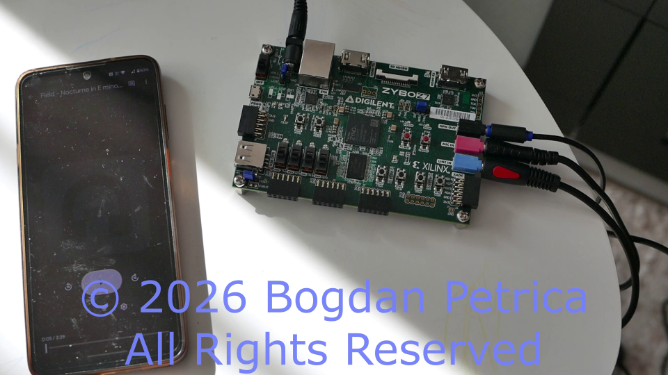
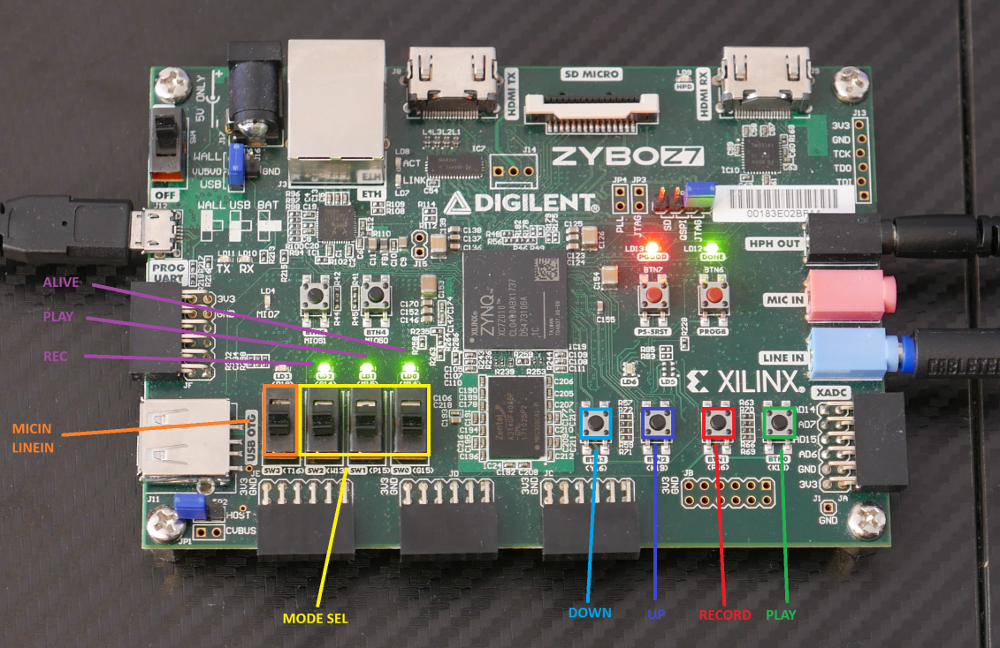

- [Introduction](#introduction)
    - [Goals](#goals)
    - [Constraints](#constraints)
    - [Non goals](#non-goals)
- [Target hardware and software](#target-hardware-and-software)
- [Getting started](#getting-started)
  - [Booting from microSD card](#booting-from-microsd-card)
- [Workflow](#workflow)
  - [Build configuration](#build-configuration)
- [Application UI guide](#application-ui-guide)
    - [Buttons and switches table](#buttons-and-switches-table)
    - [Mode selection table](#mode-selection-table)
    - [LEDs description](#leds-description)
- [Data sheet](#data-sheet)
- [Detailed design](#detailed-design)
- [Known limitations](#known-limitations)

__License notice:__ Please read [LICENSE](./LICENSE) and [NOTICE](./NOTICE) before using files distributed with this project.

# Introduction

This repository contains the application code, running on PS, of a HW/SW demo project of an audio mixer targeted to __Zynq__ devices.

More information about the project can be found [here](../README.md).

Target platform is Digilent __Zybo Z7__ board, see more info in [target hardware and software](#target-hardware-and-software).

The document is written with the intent to be followed by engineers and technical reviewers.

### Goals
- highlight audio mixer __RTL IP__ capabilities, link to the [audio mixer IP goals](../mixer_hw/README.md#audio-mixer-ip-core-goals-and-constraints)
- playback and recording from/to the __Zynq PS__
- scalable application design
- simplicity
- code audibility and maintainability
- error detection
- intuitive UX

### Constraints
- no OS, runs as bare metal application on __Zynq PS__
- minimal dependencies, allowed are C standard library which comes with AMD compiler and toolchain and the AMD bare metal drivers where applicable

### Non goals
- recovery from errors
- exhausting error detection, for example the __I2C__ driver(see [src/i2c.c](src/i2c.c)) does not check for timeouts

For a quick intro please check the video below:

[Mixer Demo](https://youtu.be/bm6tZgcA20A?si=PH2dcnjw07uSbbLT)

# Target hardware and software

Target hardware is [Zybo-Z7](https://digilent.com/reference/programmable-logic/zybo-z7/start). This project has been tested with the __Zybo Z7-7010__ version of the board, featuring the __Zynq__ device __XC7Z010-1CLG400C__. An overview of the board and the __Zynq__ device is given by Digilent [here](https://digilent.com/reference/programmable-logic/zybo-z7/reference-manual).

The project was built using __AMD Vitis Unified IDE v2024.2.0__, see [link](https://www.amd.com/en/products/software/adaptive-socs-and-fpgas/vitis.html).

# Getting started

You can get started with running the application if you have a __Vitis workspace__ setup(see [workflow](#workflow) on how to setup your __Vitis workspace__). Once you setup the __Vitis workspace__ you can build the application and generate the boot image. This repository has a prebuilt boot image for __Zybo Z7-7010__ board under [release/BOOT.bin](release/BOOT.bin).

Digilent has an excellent [tutorial](https://digilent.com/reference/programmable-logic/guides/vitis-unified-flash) on how to flash the boot image to the board.

Once it is flashed, make sure to put the 'Programming mode select jumper' JP5 into QSPI boot mode and power cycle the board to boot from flash memory.

The prebuilt boot image uses a HW platform which has the UART configured that should be accessible through the __Zybo Z7 USB-UART bridge__, see section "7 USB-UART Bridge (Serial Port)" of the  __Zybo Z7__ [reference manual](https://digilent.com/reference/programmable-logic/zybo-z7/reference-manual#usb-uart_bridge_serial_port).

The UART is used for printing log messages and is configured as follows:
- baud rate: 115200
- data bits: 8
- stop bits: 1
- no parity
- RTSCTS flow control

Once the board boots you should be able to see the log messages sent over UART, similar to these:

```
[   0.000][ TIMER][INF]timer freq is 9995.003 HZ, period:    0.100 ms
[   0.001][   I2C][INF]i2c_init() complete
[   0.039][   SSM][INF]ssm2603_init() complete
[   0.040][   SSM][INF]reg LIV @ 0x0 = 0x97
[   0.042][   SSM][INF]reg RIV @ 0x1 = 0x97
[   0.046][   SSM][INF]reg PWR @ 0x6 = 0x0
[   0.050][   SSM][INF]reg AAP @ 0x4 = 0x10
[   0.054][   SSM][INF]reg DAP @ 0x5 = 0x8
[   0.058][   SSM][INF]reg ACT @ 0x9 = 0x1
[   0.096][   SSM][INF]ssm2603_init() complete
[   0.097][   SSM][INF]reg LIV @ 0x0 = 0x97
[   0.099][   SSM][INF]reg RIV @ 0x1 = 0x97
[   0.103][   SSM][INF]reg PWR @ 0x6 = 0x0
[   0.107][   SSM][INF]reg AAP @ 0x4 = 0x10
[   0.111][   SSM][INF]reg DAP @ 0x5 = 0x8
[   0.115][   SSM][INF]reg ACT @ 0x9 = 0x1
[   0.119][ MIXER][INF]mixer_init() complete
[   0.123][   LED][INF]TTC0 min frequency:   10000.0000 HZ, actual frequency:   10000.0996 HZ
[   0.131][   LED][INF]TTC1 min frequency:   10000.0000 HZ, actual frequency:   10000.0996 HZ
[   0.140][   APP][INF]init PS with note(sine) @ 375.000000 HZ for a time of 0.043 sec
[   0.147][   APP][INF]audio buffer size:     11250.00 KB, buffer size duration: 60.00 sec
[   0.155][   APP][INF]init complete, starting
```

## Booting from microSD card

An even easier option, that does not involve downloading __Vitis__ and creating a __Vitis workspace__, is to boot from an microSD card, Digilent describes the process in section "2.1 microSD Boot Mode" of the __Zybo Z7__ [reference manual](https://digilent.com/reference/programmable-logic/zybo-z7/reference-manual#microsd_boot_mode).

# Workflow

Current workflow avoids storing __Vitis__ generated files in the repository, instead it uses the HW file(exported platform file for __Zybo Z7-7010__ is provided by the HW project, see [here](../mixer_hw/README.md#pre-build-binaries)) and the sources with build configuration to create a __Vitis workspace__. This operation is called `import project`.

The source files are copied to the __Vitis workspace__, directory [ws/](ws/), and all the changes to the sources from within __Vitis__ will go to the workspace files and not to the repository files.

Once you are satisfied with the changes, the sources and project settings can be exported from the __Vitis workspace__ to the repository, and you can finally commit your changes. This operation is called `export project`.

To facilitate the workflow two python scripts are provided, here is one example of a full workflow(Windows 11 and  CMD are used):

```
REM import Vitis env variables and setup Windows PATH to Vitis binary
REM in this case, the Vitis was installed under C:\Xilinx
C:\Xilinx\Vitis\2024.2\settings64.bat

REM import project, provide the hardware XSA file
REM note: don't forget to change the path to XSA file, if needed
vitis -s import_project.py -h ../mixer_hw/release/design_1_wrapper.xsa

REM open vitis and setup workspace directory to ws
REM do your changes directly to the vitis workspace files

REM once done with the changes, export project to copy the files from workspace to the repository
vitis -s export_project.py
```

Note: the build configuration is stored under [config.json](./config.json), currently not all the build options that can be set in __Vitis__ are exported, if needed, the [export_project.py](export_project.py) script can be extended.

## Build configuration

The following C preprocessor defines control the compilation outcome:
- __DEBUG__ - when __DEBUG__ is defined and __NDEBUG__ is not defined the __LOG_LEVEL_DEBUG__ logging level will be enabled across all the application modules, see [src/log.h](src/log.h), also see [logging](./doc/DESIGN.md#logging)
- __DBG_ASSERT_CONF__ - when defined the __DBG_ASSERT__ macro (see [src/dbg.h](src/dbg.h)) is defined, which causes the application to emit a message over UART and hang in case of assertion failures
- __APP_PB_REC_SYNC_DISABLE__ - when user stops the recording the recorded samples are transferred to the playback buffers, when enabling this configuration the transferring is not done and the initial samples in the playback buffers are retained

# Application UI guide

Below is an image of the __Zybo Z7-7010__ board with overlays over the relevant UI elements.



The application provides the following functionality:
- playback with mixing of PL, PS(recorded), LineIn/MicIn and delay line channels
- per channel gain control
- recording from LineIn/MicIn
- delay amount control
- delay line input selection
- LEDs for feedback and switches to control the channels/delay/delay line input

__Note__: once recording is stopped the recorded samples are transferred from the recording buffers to the playback buffers, the CPU will start sending newly transferred samples to the audio mixer IP Core over DMA immediately.

### Buttons and switches table

|Name|Board element|Description|
|----|-------------|-----------|
|__Mode selection switch__|SW2(W11), SW1(P15), SW0(G15)|mode selection switch|
|__Playback button__|BTN0(K18)|start/stop playback|
|__Recording button__|BTN1(P16)|start/stop recording|
|__Up button__|BTN2(K19)|increase gain, increase delay, next channel - depending on mode selection|
|__Down button__|BTN3(Y16)|decrease gain, decrease delay - depending on mode selection|
|__LineIn/MicIn switch__|SW3(T16)|switch between LineIn(low) and MicIn(high)|

### Mode selection table

|SW2|SW1|SW0|Description|
|---|---|---|-----------|
|low|low|low|__PL signal gain__|
|low|low|high|__PS signal gain__|
|low|high|low|__LineIn/MicIn signal gain__ - depending on the LineIn/MicIn switch|
|low|high|high|__delay line signal gain__|
|high|low|low|__delay amount__|
|high|low|high|__delay channel input__|

### LEDs description

LED|Behavior|Description
|---|--------|------------|
|LED0|blinking at 1 HZ|Alive indicator, if not blinking application is hanged|
|LED1|blinking at 2 HZ|Playback indicator, when blinking playback is active|
|LED2|blinking at 4 HZ|Recording indicator, when blinking recording is active|
|LED3-LED0|LED bar|After pressing __up/down buttons__ the LEDs show current channel signal gain or delay for 0.8s, depending on the __mode selection switch__|
|LED2-LED0|Channel indicator|When the user presses __up button__ and the __mode selection switch__ is set to __delay channel input__ (high, low, high) the LEDs indicate the __delay channel input__ for 0.8s as follows:|
| | |LED0 - delay line input is PS(adds echo to PS signal)|
| | |LED1 - delay line input is LineIn/MicIn(adds echo to LineIn/MicIn)|
| | |LED2 - delay line input is feedback from the mixing output(adds reverb effect to whole mixing)|
|LED3-LED0|blinking synchronously at 1 HZ|error detected|

# Data sheet

|Parameter name|Default Value|Range|Description|
|--------------|-------------|-----|-----------|
|__PL gain__|mute|mute, -34db to +6db, 1db steps|Control PL gain|
|__PS gain__|mute|mute, -34db to +6db, 1db steps|Control PS gain|
|__LineIn/MicIn gain__|0db|mute, -34db to +6db, 1db steps|Control LineIn/MicIn gain|
|__Delay line gain__|mute|mute, -34db to +6db, 1db steps|Control delay line gain|
|__Sampling frequency__|48 kHZ|N/A|N/A|
|__Sample bit depth__|16bit|N/A|N/A|
|Recording/playback __buffer size__|11250.00 KB|N/A|The buffer size is large enough to accommodate 60s worth of samples recorded stereo at 48 kHZ using 16bits per sample|
|__Delay__|0|0-16384, 480 samples step|The maximum value gives a total delay of 0.3413s, 0.01s step|
|__LineIn__ ADC gain|0db|N/A|Audio codec ADC gain value|
|__MicIn__ ADC gain|-19.5db|N/A|Audio codec ADC gain value|
|Playback __buffer samples__|sine wave @ 375 HZ|N/A|Used for testing|
|STDOUT|__Zynq PS__ UART|N/A|N/A|
|STDIN|__Zynq PS__ UART|N/A|N/A|

# Detailed design

See [design](./doc/DESIGN.md).

# Known limitations

Current known limitations:
- delay changes are discrete, leads to audible distortion
- gain changes are discrete, leads to audible distortion
