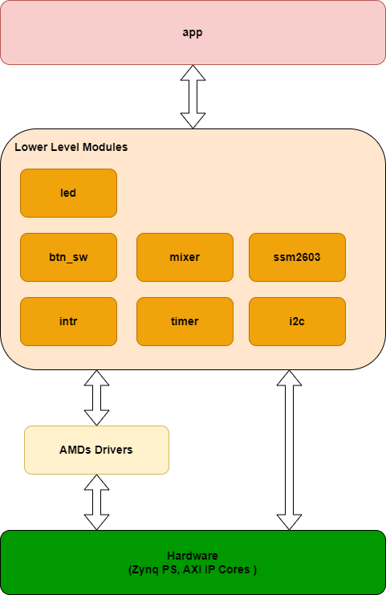
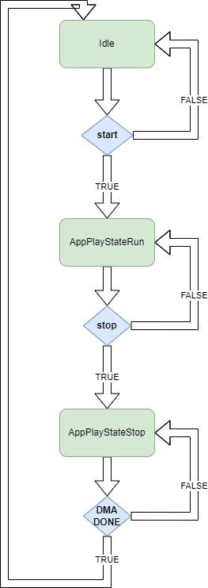

- [Introduction](#introduction)
- [High level design view](#high-level-design-view)
- [Detailed design](#detailed-design)
  - [Recording/Playback FSMs](#recordingplayback-fsms)
  - [Lower level modules](#lower-level-modules)
    - [Intr](#intr)
    - [Timer](#timer)
    - [Logging](#logging)
    - [I2C](#i2c)
    - [SSM2603](#ssm2603)
    - [Mixer](#mixer)
    - [BTN\_SW](#btn_sw)
    - [LED](#led)
  - [Interrupts and interrupts configuration](#interrupts-and-interrupts-configuration)
- [Further improvements](#further-improvements)

# Introduction

This document contains the detail design as well as the tradeoffs done when realizing the audio mixer software application.

Please see the README's [goals](../README.md#goals) and [constraints](../README.md#constraints).

Besides the goals and constraints the system has to respond timely to interrupts from the audio mixer core DMA transfers. This "timely" is related to the audio mixer internal sample buffers, currently as it is configured the buffers have 256 samples for recording and playback each. More details can be found [here](../../mixer_hw/doc/AudioMixerIP.md#rec2axis) and [here](../../mixer_hw/doc/AudioMixerIP.md#axis2pb)

At the system audio sampling frequency(__48 kHZ__) the buffers drain in 5.3ms. From the interrupt completion until the next DMA operation starts pushing/pulling data the time must not exceed the 5.3ms or the system would experience buffer overflows/underflows and gaps in recording/playback will appear.

The application is structured to run on one CPU of the two that PS subsystem of __Zynq__ device offers.

# High level design view

The design follows a stacked structure, where the bottom layers of the stack are various utility drivers such as timer, IRQ support, logging, audio mixer IP driver, etc. and the application that sits on top of the infrastructure and provides the glue logic and the corresponding FSMs.



# Detailed design

Most of the IPs integrated into the platform receive commands via memory mapped register access, provide status through memory mapped registers and notify the host system CPU of important events through interrupts.

Interrupts make the drivers reentrant and this means that any driver API must support it, in order to keep the complexity low and still have a responsive system the following approach has been taken: interrupt handlers are not allowed to call any application code, this makes the interrupt handlers non reentrant. Instead, the interrupt handlers, setup "events", or "flags" which will "wake up" the application main loop.

Since most of the modules are largely independent from each other, and the fact that application is single threaded, there is not much need of synchronization protection(like interrupt disabling) in the modules implementations.

In cases where polling has been used instead of interrupts for event detection, a similar approach is taken, upon event detection a "flag" is set up which makes the application main loop process it.

Main loop pseudocode:

```c
while(1) {
    event_t event;
    app_wait_for_event(&event);
    app_process_event(&event);
}
```

Currently the events are encoded as a set of "flags", that is, a set of booleans, every loop they are set. The events are transient and not retained into the next loop iteration, the application logic has to be careful enough to not lose important events.

The __disadvantage__ of the approach taken is that interrupt response latency is increased, that is, the application will not process the next highest priority event until finishes processing the current event; this is not a problem as the system was designed that all the realtime requirements are handled in the audio mixer core and the PS realtime requirements are relaxed to milliseconds. See [audio mixer IP Core goal](../../README.md#audio-mixer-ip-core).

## Recording/Playback FSMs

The platform has the constraint that the DMA Device to Memory transfer can't be interrupted. If interested about the reasons behind see [this](../../mixer_hw/doc/AudioMixerIP.md#rec2axis).

The [__AXI DMA__](https://docs.amd.com/r/en-US/pg021_axi_dma/) IP Core can be stopped, according to AMD's documentation, however because the audio mixer Master __AXI Stream__ can't be stopped, the only possibility is to fully reset the audio mixer IP core, which disrupts the playback experience.

Instead of disrupting the playback experience it was chosen to allow the DMA transfer to run to completion, this has the effect that the stop will not be instant but can take up to 5.3ms.

The delay of stopping in 5.3ms has no noticeable impact on user experience.

For symmetry the same approach was taken on the playback side. The recording and playback control are implemented as FSMs following the pattern in the image below.



The two FSMs are run independently but communicate when recording stops - recorded samples must be transferred to the playback side.

## Lower level modules

### Intr

Simple wrapper over the AMD's GIC(generic interrupt controller) driver. For IP documentation please see [here](https://docs.amd.com/r/en-US/ug585-zynq-7000-SoC-TRM/Interrupts?tocId=My7GaP61Huu82dSLYvUT7w).

The purpose of this module is to simplify the interrupt setup process and reduce boilerplate code, for more information see __XScuGic__ driver API in `xscugic.h` platform file.

### Timer

Keeps track of elapsed time using __Zynq PS__ per processor private timer, the clients can only query the current timer value. The private timer is derived from the __Zynq PS__ CPU frequency and is not suitable for precise time calculation, however, it is good enough for the purpose of this application:
- debounce timeouts
- LED blinking frequencies
- feedback timeouts

There is no elapsed timer notification, the clients can compute elapsed time by subtracting the timer value.

See AMDs documentation about __Zynq__ private timers [here](https://docs.amd.com/r/en-US/ug585-zynq-7000-SoC-TRM/CPU-Private-Timers-and-Watchdog-Timers).

Timer uses [logging](#logging) component, which in turn uses the timer value - a circular dependency. Because the timer operation is only read of the current time, there is no issue other than that until the timer starts, the reported elapsed time is 0.

### Logging

Simple macro over the `printf`; allows compile time enable/disable of logging statements.

When __DEBUG__ is defined and __NDEBUG__ is not defined, all logging statements are enabled, including those using the log level __LOG_LEVEL_DEBUG__, otherwise only log statements with levels __LOG_LEVEL_INFO__ and __LOG_LEVEL_ERROR__ are enabled. The log statements are sent to the `printf` stdlib function call.

The Vitis platform is configured to route __STDOUT__ to the PS UART which for the current platform (__Zybo-Z7__) goes through USB-UART bridge.

### I2C

Wrapper over AMD __AXI IIC__ driver. The driver controls the [AXI IIC IP core](https://docs.amd.com/v/u/2.0-English/pg090-axi-iic) that resides on the platform PL(programmable logic). The IP parameters such as AXI address, etc. are defined in the platform file and exported using standard Vitis `xparameters.h` file.

The AMD's __AXI IIC__ driver is heavy state driven and feeds back the results through events which are passed in callbacks from an interrupt context. The approach is desirable for the driver as the __I2C__ speeds are typically low(hundreds of kHZ) and communicating over __I2C__ in polling mode is wasting CPU cycles.

The __I2C__ is mostly used during initialization of the audio codec and when controlling the audio codec's ADCs and DACs during the following events:
- ADC un-mute when playback or record is becoming active
- ADC mute on when neither playback nor record is active
- DAC mute on playback active
- DAC un-mute on playback active
- LineIn/MicIn switch

Given all this, simplicity was favored over the "timely" response from the __I2C__ and the send/recv operations poll for interrupt completion.

Worst case stall analysis for the [SSM2603](https://www.analog.com/media/en/technical-documentation/data-sheets/SSM2603.pdf) __I2C__ communication:
* send operation bits: 29bits, at __100 kHZ__ it takes about 0.00029s or 0.29ms
* recv operation bits: 48bits, at __100 kHZ__ it takes about 0.00048s or 0.48ms

A moderate number(2-6) of __I2C__ operations during recording/playback will not lead to audio mixer core buffer overflows/underflows due to DMA ISR service latency.

Current maximum number of operations is 4 recv + 2 send = 4 * 0.48ms + 2 * 0.29ms = 2.5ms, half of the maximum audio mixer DMA interrupt latency before overflows/underflows.

Ways to mitigate the polling impact:
* increase audio mixer internal sample buffers capacity as they currently are set to the minimum, see [here](../../mixer_hw/README.md#data-sheet)
* increase __I2C__ communication frequency, the __SSM2603__ supports up to __526 kHZ__ operating frequency for the I2C SCLK line
* get rid of the polling mode - this is the most scalable way, it means that the __I2C__ send/recv state machines will be initiated in the calling context of the application and will be driven in the interrupt context until finished, this approach keeps the application simple(just issues send and recv commands) and has the disadvantage that error state will be communicated through an event(not a callback, see [Detailed Design](#detailed-design)), however the disadvantage has no foreseeable impact on the application

### SSM2603

Used to control the [SSM2603](https://www.analog.com/media/en/technical-documentation/data-sheets/SSM2603.pdf) audio codec and is built directly on top of the [I2C](#i2c) module.

The module initializes the audio codec as per Analog Devices's data sheet:
1. reset the device(extra step added)
2. power on all the required audio codec blocks except the __Out__
3. configure all the remaining registers
4. __activate__ the digital audio core, inserting waits as required
5. finally power on the __Out__ circuit

It was observed that audio quality suffers sometimes when connecting the codec LineIn to a laptop LineOut, which typically have poor ground insulation, and this can cause noise coupling in the codec analog path during initialization.

The workaround is to repeat the initialization sequence twice, the first sequence initializes the analog circuit internal state, while the second sequence ensures clean configuration.

### Mixer

Module use to control the [audio mixer IP Core](../../mixer_hw/doc/AudioMixerIP.md) and provides the following functions:
* control channel gain
* control __delay__ and __delay line__ channel input
* provide recording and playback DMA access

The DMA is done through the __AXI DMA__ IP Core, please see [AMD's documentation](https://docs.amd.com/r/en-US/pg021_axi_dma/). The __AXI DMA__ IP Core is used in Simple mode and notifies the host CPU of completion or errors by raising interrupts. The interrupts set "flags" that triggers the application main loop DMA processing.

### BTN_SW

Wrapper over the __AXI GPIO__ Driver that controls the [AXI GPIO IP Core](https://docs.amd.com/r/en-US/pg144-axi-gpio).

Used to read the __BTN3-BTN0__ and __SW3-SW0__ from the __Zybo Z7-7010__ board. Currently doesn't make use of the interrupt support provided by the IP CORE.

The wrapper provides button de-bouncing; the upper levels can focus on state control.

### LED

The __LED__ component allows controlling of the LED3-LED0 of the __Zybo Z7-7010__ board. If offers brightness control using PWM feature of the __Zynq PS__ triple timer counters.

More information on the triple timer counters can be found [here](https://docs.amd.com/r/en-US/ug585-zynq-7000-SoC-TRM/Triple-Timer-Counters-TTC).

__Note__: Access to the TTC HW is done using the lower level driver, `xttcps_hw.h`, as the higher level driver allows controlling only the first timer counter of the triplet.

__Note__: Initially __LED__ was using the __AXI GPIO__ to drive the LEDs, but the __AXI GPIO IP__ does not provide PWM features.

## Interrupts and interrupts configuration

|Interrupt|Priority|Notes|
|---------|--------|-----|
|Timer|0|Highest priority to ensure accurate time tracking, is configured to fire at __10 kHZ__ and is kept short, just increases a counter(ISR service time not measured, probably tens of CPU cycles), there is no other interaction with the hardware as the timer is configured in auto-reload mode and the interrupt is edge triggered|
|DMA Memory to Device|8|DMA transfer gets second-highest priority to keep the DMA interrupt latency low and avoid sample gaps|
|DMA Device to Memory|8|Same priority as with DMA Memory to Device but the GIC will choose the lower numbered interrupt in case both are asserted, that means DMA Memory to Device has higher priority, see [AMD's documentation](https://docs.amd.com/r/en-US/ug585-zynq-7000-SoC-TRM/Interrupt-Prioritization)|
|__I2C__|10|__I2C__ has lowest communication speed, lowest priority to avoid increasing DMA interrupts latency, see [I2C section](#i2c)|

__Note on the timer interrupt__: the timer keeps track of elapsed time by increasing the tick count every interrupt, this means between two interrupts there is a timer quantization error of 0.1ms, increasing the interrupt frequency improves accuracy but adds CPU load. Other ways to improve accuracy are possible, for example by reading both the tick count and the CPU private counter value, however, for this application the accuracy of 0.1ms is enough.

__Notes on interrupt nesting__: by default the __Zynq PS__ does not enable interrupt nesting, they must be manually enabled. Nesting enable is per ISR as the current ISR interrupt source must be cleared before, otherwise the will issue ISR calls as soon as nesting is enabled. Without nesting the timer can accumulate drift. Given that timer is only used for UI events with short time spans, the quantization error and the drift have no noticeable impact on the UX.

# Further improvements

The following is a list of possible further improvements and enhancements:
* add TIMEOUT error detection to [I2C](#i2c) wrapper
* enable interrupt nesting for removal of timer drift
* improve [I2C](#i2c) wrapper to drive the FSMs from it's event context and remove polling and decrease overall DMA interrupt service latency
* improve event management, store events in a queue to avoid losing events at the application loop level
* use interrupts for GPIO events of [buttons and switches](#btn_sw)
